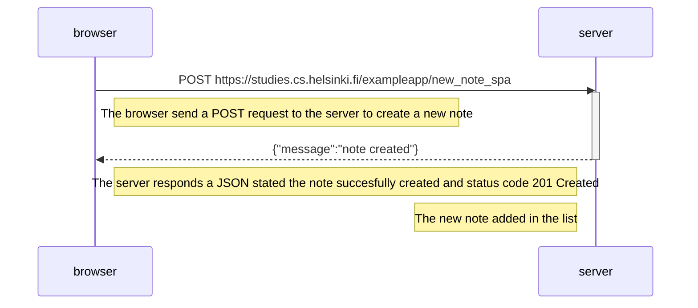

```mermaid
sequenceDiagram
    participant browser
    participant server

    browser->>server: POST https://studies.cs.helsinki.fi/exampleapp/new_note_spa
    activate server

    Note right of browser: The browser send a POST request to the server to create a new note

    server-->>browser: {"message":"note created"}
    deactivate server

    Note left of server: The server responds a JSON stated the note succesfully created and status code 201 Created

    Note left of server: The new note added in the list
```
